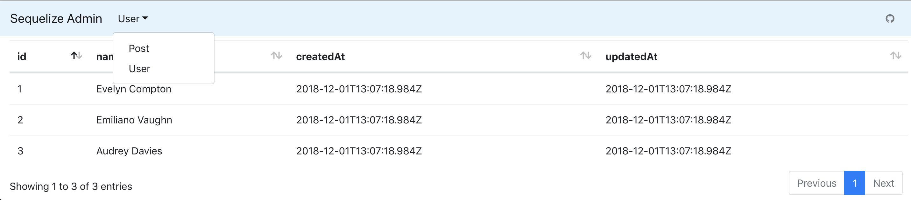

## Install

```
npm install giladno/sequelize-admin
```

## Usage

```
const Sequelize = require('sequelize');
const admin = require('giladno/sequelize-admin');

const sequelize = new Sequelize(...);

...

app.use('/admin', admin(sequelize, opt));
```

### Options

```
{
    // `limit` is the number of records to return per page
    limit = 50,

    // `include` will only include a set of specific fields from the model: {include: {User: ['id', 'title']}}
    include = {},

    // `exclude` will omit a set of fields from the model: {exclude: {User: ['password']}}
    // to omit the entire model, set it to `true`: {exclude: {SensitiveTable: true}}
    exclude = {},

    // `title` will set the <title> tag
    title = 'Sequelize Admin',

    // `logo` url for a custom logo
    logo,

    // https://getbootstrap.com/docs/4.0/components/navbar/#color-schemes
    navbar = 'light',

    // `backgroundColor` will set the background color of the navigation bar
    backgroundColor = '#e3f2fd',
}
```
